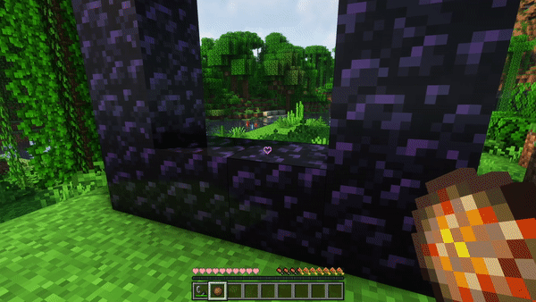
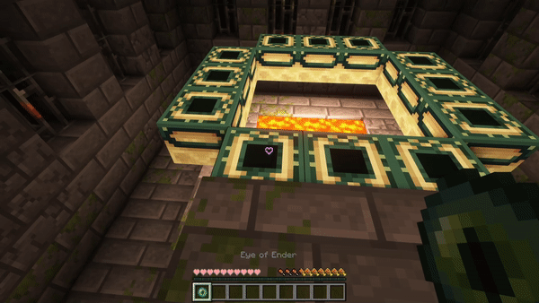
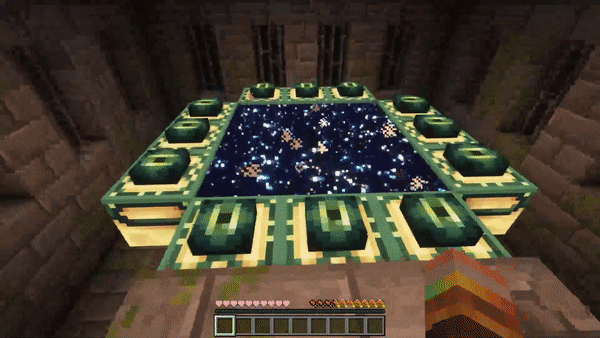

Allows you to toggle if nether and end portals can be activated and used.

> Great for multiplayer servers where you want to wait before allowing players into other dimensions

When activated it will prevent players from lighting nether portals and putting eyes into end portals, and it will break any existing portal when players try to use it.

There is a configurable message that will be shown on failure

## Configuration
You can open a clickabe configuration screen in chat by running:

`/function deactivateportals:config`

## Showcase

> Showcase with a flint and steel

> Showcase with a fire charge

> Showcase with a lit portal

> Showcase with eyes of ender

> Showcase with an activated end portal
